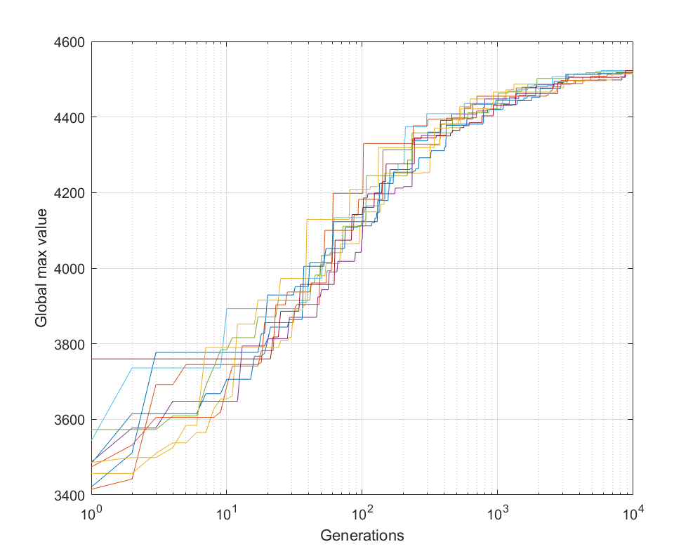
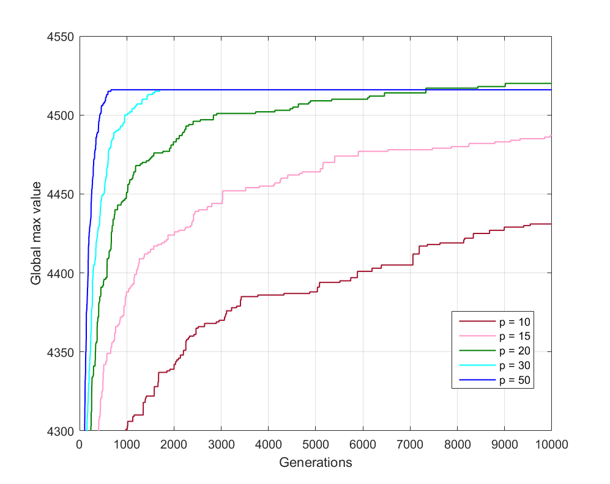
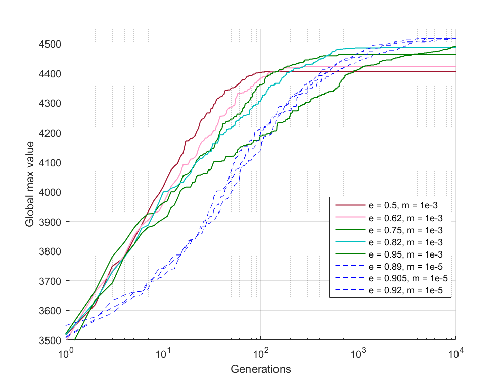
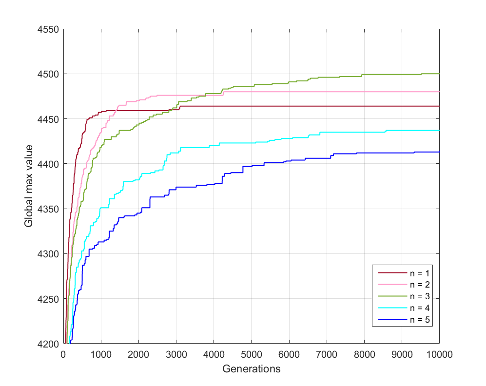

# Knapsack

Solving the [1-0 one dimensional Knapsack problem](https://en.wikipedia.org/wiki/Knapsack_problem) using [Ant Colony Optimization](https://en.wikipedia.org/wiki/Ant_colony_optimization_algorithms).

## Results
Results from 10 different runs with the final parameters:

Experiments with size of population:

Experiments with evaporation rate:

Experiments with elitism, i.e. how many ants will distribute pheremones every iteration:

